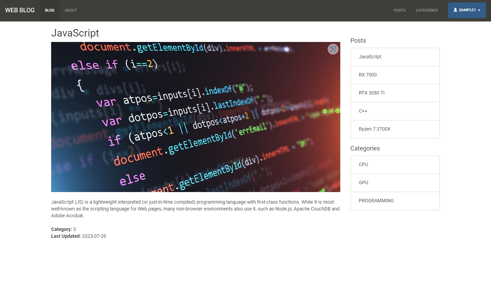

# Web Blog

The Web Blog Site is a full-stack web application that was develop as a learning process, to explore the depths of full-stack technologies. Note that it is not intended to be an actual service. The application allows registered users to create, view, and manage blog posts in a user-friendly interface, while unregistered visitors can freely browse all posts. It provides a seamless experience for both readers and registered writers, with features like user authentication, post creation, post categories, and a responsive layout.

Visit the live project [here](https://zany-dove-baseball-cap.cyclic.app/about), which is hosted on Cyclic. Do allow a few seconds for the site to load as it is hosted on a free service.

## Technologies / Libraries

- bcryptjs
- client-sessions
- cloudinary
- express
- express-handlebars
- JavaScript
- mongoose
- multer
- Node.js
- pg
- pg-hstore
- sequelize
- streamifier
- strip-js

## Database / Media Management

- Database Hosting: ElephantSQL (PostgreSQL)
- Database: MongoDB (NoSQL)
- Media Management: Cloudinary

## Features

- User Registration and Authentication: Users can sign up and log in to access additional features like creating and deleting blog posts.
- View All Posts: Unregistered visitors can view all blog posts without logging in.
- Create, Read, and Delete Operations: Registered users can create new blog posts, read existing ones, and delete unwanted posts.
- Post Categories: Blog posts can be categorized, allowing readers to filter and view posts by specific category.
- Responsive Design: The site is designed to be responsive, adapting to various screen sizes and devices.
- Dynamic Navigation: The navigation menu automatically highlights the active page, providing a visual indicator to users.
