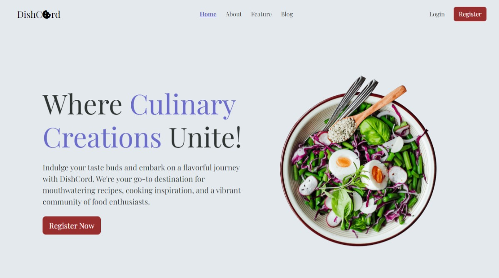

# DishCord

Dishcord is a web application designed to make culinary exploration a delightful experience.
The site allows registered users to create, view, and manage there own posts in a user-friendly interface, while unregistered visitors can freely browse all posts.

Explore the application by clicking [here](https://dish-cord.onrender.com). Do be patient for the initial spin up, as it's hosted on a free service, and may take up to a minute.

## Technologies and Frameworks Used

### Frontend Technologies:

- JavaScript
- Bootstrap 5
- Handlebars.js
- SCSS

### Backend Technologies:

- Node.js
- Express.js
- Mongoose (MongoDB)
- Sequelize (PostgreSQL)

### Additional Libraries and Dependencies:

- Streamifier
- Express Session
- Dotenv

### DB / Database Hosting:

- MongoDB
- ElephantSQL

### Media Management:

- Cloudinary

## Key Features

- **User Registration and Authentication:** Users can easily sign up and log in to access enhanced features such as creating and managing posts and categories.

- **Recipe Posting:** Registered users have full control over their food recipe posts, with the ability to create, read, update, and delete their own content.

- **Accessible for All:** Unregistered visitors are welcome to explore the platform and view all posts without needing to log in.

- **Post Categories:** Posts are intelligently categorized, enabling readers to filter and discover content based on specific categories of interest.

- **Responsive Design:** The website is thoughtfully designed to offer an optimal user experience across various devices and screen sizes.
